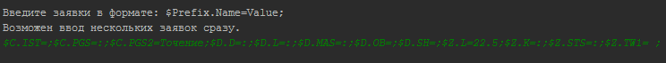
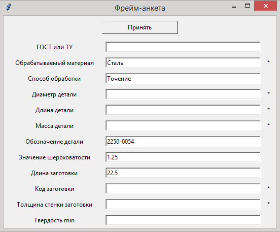
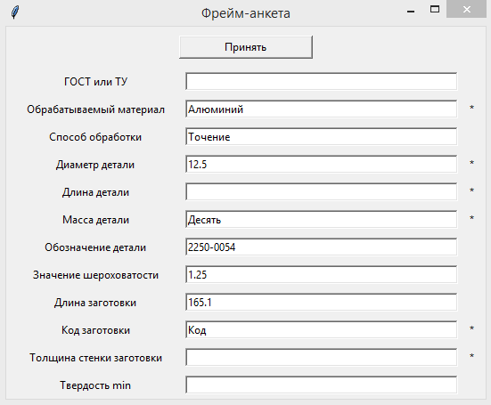
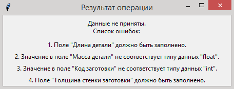
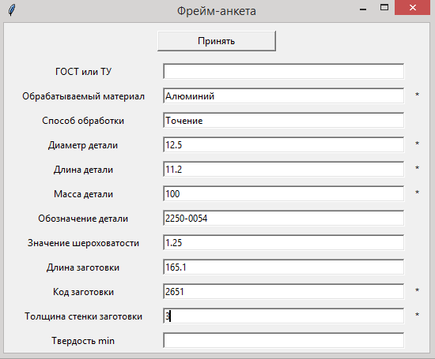
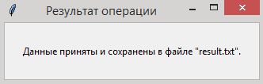
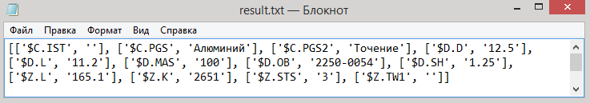
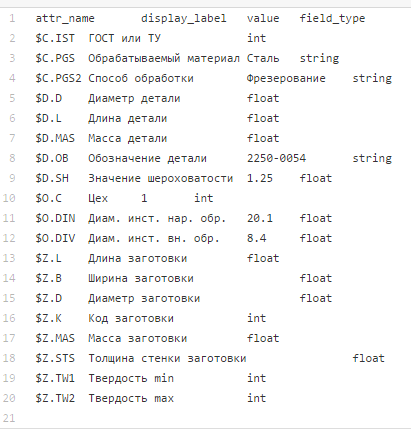

# form-frame (Фрейм-анкета)

Пользователь запускает программу **gui.py**, вводит запрос в формате: **$prefix.name=value;** 
Возможен ввод нескольких триплетов подряд (Русунок 1).

* **prefix**: один или более символ (A-Z, a-z);
* **name**: один или более символ (A-Z, a-z, 0-9);
* **value**: любое количество любых символов;
 * **пустое значение**: значение будет взято из словаря метаданных (заполнение НЕ обязательно);
 * **пробел**: значение будет взято из словаря метаданных (заполнение НЕ обязательно);
 * **двоеточие**: значение будет взято из словаря метаданных (заполнение обязательно);
 * **любое другое значение**: будет использоваться введенное значение.

После осуществляется сравнение запроса с данными в словаре метаданных.
Генерируется фрейм-анкета (Рисунок 2), в которой вместо триплета отображается его читаемое имя
и поле ввода значения. По умолчанию будет использовано введенное значение или значение из словаря метаданных (в зависимости от запроса). Если рядом с текстовым полем стоит звездочка (*), то это значит, что поле обязательно для заполнения. 

После ввода данных в анкету, нужно нажать кнопку **"Принять данные"**. Далее откроется окно с результатами операции, в котором будет сообщение об успешном сохранении данных (Рисунок 6) в файле **result.txt** (Русунок 8) или список ошибок (Рисунок 4).

**Нереализованные функции:**
* Запрет некорректного ввода после первого триплета.

В словаре метаданных (**database.txt**) хранится (см. рисунок 7):
* Для каждой пары класс + имя ($prefix.name) хранится читаемое имя (display_label).
Например, для класса L и имени NM читаемое имя – «Тип фрезы».
* Значение поля по умолчанию (value).
* Тип каждого поля (field_type). Например, String, Int, Float.

### Пример работы программы
**Рисунок 1.** Пример запроса:

**Рисунок 2.** Сгенерированная анкета:

**Рисунок 3.** Анкета после заполнения некоторых полей пользователем:

**Рисунок 4.** Сообщение со списком ошибок:

**Рисунок 5.** Анкета с заполнение полей без ошибок:

**Рисунок 6.** Сообщение об успешном сохранении данных:

**Рисунок 7.** Результирующий файл:

**Рисунок 8.** Словарь метаданных:

